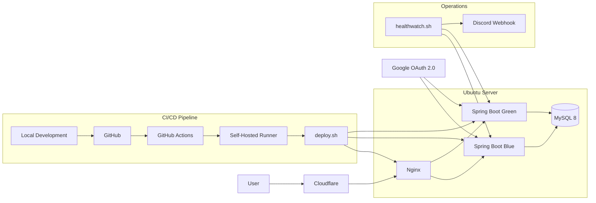

# 두두타 도감

Heartopia(두근두근타운) 유저를 위한 종합 도감 및 인터랙티브 지도 서비스

1인 개발로 운영 중이며, 지난 7일간 GA4 기준 활성 사용자 3,800명과 페이지 조회수 9만 회를 기록했습니다.

서비스명은 `두두타 도감`이며, 저장소는 `heartopia-wiki`, 배포 도메인은 [heartopia-life.me](https://heartopia-life.me) 를 사용하고 있습니다.


---

두두타 도감은 흩어져 있는 Heartopia 정보를 한 곳에서 빠르게 찾을 수 있도록 만든 서비스입니다.
주민, 수집 도감, 작물, 요리, 선물 취향, 기프트코드, 지도 정보를 한 곳에서 탐색할 수 있도록 구성했습니다.

## 주요 화면


### 1. 통합 검색


메인 화면에서 검색어를 입력하면 주민, 아이템, 도감 데이터를 통합 검색할 수 있도록 구현했습니다.
입력 중에는 디바운싱을 적용해 불필요한 API 호출을 줄이고 검색 응답 흐름을 안정화했습니다.


### 2. 도감 화면


물고기, 새, 곤충 등 주요 도감 데이터를 카테고리와 필터 중심으로 탐색할 수 있도록 구성했습니다.
많은 데이터를 한 화면에서 비교하고 탐색할 수 있도록 정보 구조를 정리했습니다.


### 3. 인터랙티브 지도


도감 데이터와 지도 데이터를 연결해, 선택한 항목의 위치를 지도에서 바로 확인할 수 있도록 구현했습니다.
핀 클릭과 위치 하이라이트를 통해 위치 기반 탐색 경험을 강화했습니다.

## 주요 기능

- 통합 검색: 주민, 아이템, 수집 도감 데이터를 한 번에 탐색할 수 있는 검색 기능
- 인터랙티브 지도: 도감 데이터와 연계해 위치를 지도에서 바로 확인할 수 있는 기능
- 로그인 및 저장 기능: Google OAuth 기반 로그인과 수집도감 저장 기능을 제공하며, 비로그인 상태에서는 `localStorage`, 로그인 시에는 DB와 연동해 기기 간 이어서 사용할 수 있도록 구성했습니다.
- 관리자 기능: 기프트코드, 문의, 공지 데이터를 관리할 수 있는 운영 페이지


## 어떤 문제를 해결하는 서비스인가?

Heartopia(두근두근타운) 관련 정보는 여러 커뮤니티 게시글과 이미지에 흩어져 있어,
유저가 원하는 정보를 다시 찾기 어렵고 위치 정보까지 함께 확인하기도 번거로웠습니다.

두두타 도감은 주민, 수집 도감, 작물, 요리, 선물 취향, 기프트코드, 위치 정보를 한 곳에서 탐색할 수 있도록 구성한 서비스입니다.
정보 조회에서 끝나지 않고, 검색 결과와 지도 기능을 연결해 실제 플레이에 바로 활용할 수 있도록 설계했습니다.


## 핵심 성과

- 지난 7일간 GA4 기준 활성 사용자 3,800명과 페이지 조회수 9만 회를 기록했습니다.
- 지도 핀 조회 로직을 개선해 응답 시간을 1051ms에서 205ms로 단축했습니다. (Spring AOP 로그로 측정)
- GitHub Actions, Docker Compose, Nginx 기반으로 배포 및 운영 자동화 환경을 구성했습니다.


## 구현 영역

- 백엔드: 도감/지도/검색 기능 API 및 비즈니스 로직 구현
- 데이터: MySQL 스키마 설계 및 MyBatis 기반 데이터 접근 로직 작성
- 인증: Google OAuth 로그인 및 관리자 인증 기능 구현
- 프론트엔드: Thymeleaf 기반 화면 구성과 JavaScript, Fetch API 기반 인터랙션 구현
- 인프라/운영: Docker Compose, Nginx, GitHub Actions 기반 배포 및 운영 자동화 구성


## 기술 스택

- Backend: Java 17, Spring Boot, Spring Security, MyBatis
- Database: MySQL 8
- Frontend: Thymeleaf, JavaScript, Fetch API
- Infra: Docker Compose, Nginx, Cloudflare
- Deployment: GitHub Actions, Self-Hosted Runner
- Monitoring: GA4, healthwatch.sh, Discord Webhook


## 아키텍처



Cloudflare와 Nginx를 거쳐 Spring Boot 애플리케이션으로 요청을 전달하고,
GitHub Actions와 Self-Hosted Runner 기반의 Blue-Green 배포 및 운영 자동화를 구성했습니다.


## 대표 트러블슈팅


### 1. Blue-Green 배포 안정화

배포 과정에서 신규 컨테이너가 완전히 기동되기 전에 트래픽이 전환되면서 `502 Bad Gateway`가 발생하는 문제가 있었습니다.  
`deploy.sh`에 헬스 체크 로직을 추가해 신규 컨테이너가 정상 응답을 반환한 뒤에만 트래픽을 전환하도록 수정했습니다.

또한 Nginx 설정 반영 방식과 트래픽 전환 흐름을 조정해, GitHub Actions와 Self-Hosted Runner 기반의 무중단 배포 환경을 안정화했습니다.

### 2. 비정상 트래픽 차단 및 운영 보호

실서비스 운영 중 외부 봇과 비정상 요청이 집중되면서 서버 응답이 불안정해지는 문제가 있었습니다.  
Nginx `rate limiting`, 악성 경로 차단, 타임아웃 조정을 적용해 요청을 제어하고, 운영 로그를 바탕으로 반복되는 공격 패턴에 대응했습니다.

이를 통해 서비스 장애 가능성을 낮추고, 운영 중 발생하는 비정상 트래픽에 대한 방어 체계를 구성했습니다.

### 3. 지도 조회 성능 개선

지도 핀 조회 과정에서 각 핀마다 도감 데이터를 반복 탐색하는 구조로 인해 응답 속도가 저하되는 문제가 있었습니다.  
기존의 반복 탐색 구조를 `HashMap` 기반 조회로 변경해 데이터 매핑 비용을 줄였고, Spring AOP 로그 기준 응답 시간을 `1051ms`에서 `205ms`로 단축했습니다.

실서비스 기능을 유지한 상태에서 별도 캐시 서버 없이 애플리케이션 레벨 최적화만으로 성능을 개선했습니다.


## 로컬 실행 방법

```bash
# 1. 저장소 클론
git clone https://github.com/jerkyoon8/heartopia-life.git
cd heartopia-life/heartopia-wiki

# 2. MySQL 데이터베이스 생성
mysql -u root -p -e "CREATE DATABASE heartopia_db;"

# 3. 환경변수 파일 생성
# src/main/resources/application-secret.properties
DB_PASSWORD=your_mysql_password

# 4. 애플리케이션 실행
./gradlew bootRun
```

애플리케이션 실행 후 `http://localhost:8080/wiki` 에서 확인할 수 있습니다.


---
