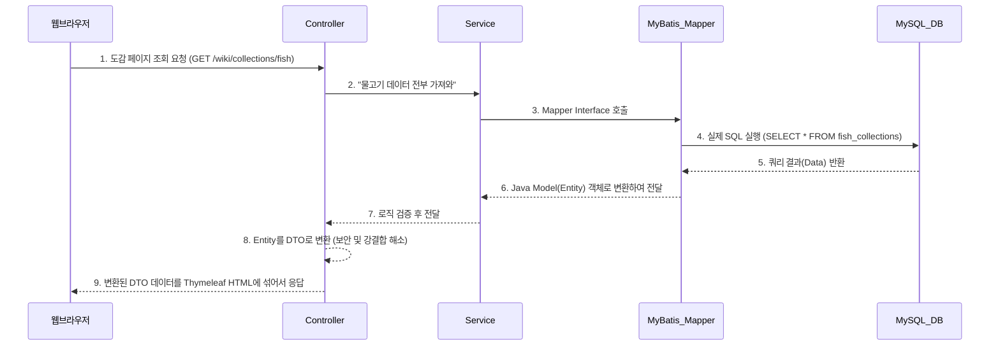

# 👑 하토피아 위키 (Heartopia Wiki) - 궁극의 기술 & 면접 완전판

이 문서는 이전까지 논의했던 **[1. 전체 아키텍처 구조], [2. 실제 백엔드/SQL 상세 코드 기술 스펙], [3. 보안 및 최적화(인프라)], [4. 모든 면접 예상 Q&A 방어 매뉴얼]** 을 단 하나의 문맥으로 완벽하게 통합한 "궁극의 마스터가이드"입니다.

---

# 📚 파트 1: 프로젝트 뼈대와 작동 원리 (Architecture)

## 1. 사용 기술 스택 (Tech Stack)
* **Backend**: Java 17, Spring Boot 3.4.2
* **Database**: MySQL 8.0, MyBatis 3.0.3, HikariCP (Connection Pool)
* **Security & Exception**: Spring Security (BCrypt, CSRF), `@ControllerAdvice`
* **Frontend**: HTML5, CSS3, Vanilla JS (ES6 Fetch API), Thymeleaf
* **Infra/Tuning**: Gzip 데이터 압축, 정적 리소스 해시 캐싱(Content-Hash)

## 2. 전체 폴더 구조 분해도
```text
c:\Users\k\Documents\heartopia-wiki-project\heartopia-wiki\
├── src/main/java/com/heartopia/wiki/
│   ├── config/        👉 [보안] SecurityConfig (스프링 시큐리티 설정)
│   ├── advice/        👉 [예외] GlobalExceptionHandler (AOP 기반 전역 에러 통제망)
│   ├── controller/    👉 [수신] WikiController, MapController 등 (브라우저 요청 접수)
│   ├── service/       👉 [로직] CollectionService 등 (비즈니스 로직 및 자바 스트림 연산)
│   ├── mapper/        👉 [DB] CollectionMapper 등 (DB 통신을 위한 MyBatis 인터페이스)
│   ├── dto/           👉 [포장] 화면에 보낼 데이터만 담는 Data Transfer Object
│   └── model(entity)/ 👉 [원석] DB 테이블과 1:1로 매칭되는 순수 객체 데이터
│
└── src/main/resources/
    ├── application.properties 👉 [환경] 최고 수준의 성능 튜닝 및 DB/오류 제어 설정
    ├── mapper/            👉 [SQL] 실제 SELECT/INSERT 문들이 빽빽하게 담긴 XML 파일들
    └── templates/ & static/ 👉 [화면] Thymeleaf HTML 파일과 CSS/JavaScript/이미지
```

## 3. 핵심 동작 흐름 (Data Flow Sequence)
사용자가 도감 페이지를 누르면 아래와 같은 순서로 데이터베이스부터 화면까지 데이터가 흘러갑니다.


---

# 💻 파트 2: 심층 기술 스펙 및 실제 구현 코드 (Deep Dive)

면접관에게 '단순 코더가 아님'을 증명하는 실제 구현 코드 다이브입니다.

## 핵심 1. SQL 쿼리 모듈화 및 최적화 (MyBatis XML)
`CollectionMapper.xml`을 보면 단순 반복되는 쿼리를 막기 위해 고급 문법을 썼습니다.
```xml
<!-- 1. 공통 컬럼 조각 정의 (DRY 원칙) -->
<sql id="fishColumns">
    id, location, sub_location, name, level, weather, time, price_1, image_url
</sql>

<!-- 2. 실제 조회 시 조각(include)을 갈아 끼움 -->
<select id="findAllFish" resultType="com.heartopia.wiki.model.FishCollection">
    SELECT <include refid="fishColumns"/> FROM fish_collections ORDER BY id ASC
</select>
```
```xml
<!-- 3. 동적 서브쿼리를 탑재한 CASE WHEN (요리 재료 테이블) -->
<select id="findIngredientsByCookingId" resultType="com.heartopia.wiki.model.CookingIngredient">
    SELECT ci.id, ci.cooking_id, ci.ingredient_name, ci.item_type,
        CASE ci.item_type
            WHEN 'crop'       THEN (SELECT image_url FROM crop_collections       WHERE id = ci.item_id)
            WHEN 'fish'       THEN (SELECT image_url FROM fish_collections       WHERE id = ci.item_id)
        END AS imageUrl
    FROM cooking_ingredients ci WHERE ci.cooking_id = #{cookingId}
</select>
```
* **기술 해설**: 테이블 구조가 바뀔 때 수십 개의 쿼리를 다 뜯어고치지 않도록 `<sql>` 태그 모듈화를 적용했고, 이종 데이터 조인이 필요한 요리 테이블에서는 `JOIN` 남발 대신 `CASE WHEN`과 서브쿼리를 사용하여 깔끔하게 분기 처리했습니다.

## 핵심 2. Application 레벨 데이터 조인 (Java 8 Stream)
`MapController` 코드 핵심 발췌
```java
private void enrichPinDetails(MapPin pin) {
    // DB 쿼리 JOIN 이 아닌, 메모리 상에 올라온 자바 리스트를 활용해 조립
    collectionService.getAllFish().stream()
            .filter(f -> f.getName().equals(pin.getName())) // 이름이 같은 객체 필터링
            .findFirst() // 첫번째 탐색
            .ifPresent(f -> {
                // 핀 정보에 물고기 정보를 병합시킴
                details.put("위치", formatLocation(f.getLocation(), f.getSubLocation()));
                details.put("가격", String.valueOf(f.getPrice1()));
            });
}
```
* **기술 해설**: 5개가 넘는 카테고리(물고기,곤충,동물 등)를 무리하게 DB 커리로 JOIN 하면 성능이 매우 떨어집니다. 서버 단에서 각각 데이터를 호출한 후 **Java 8 Stream API** 를 이용해 자바 코드로 병합(Aggregation)시켜 데이터베이스 통신 병목을 해결한 가장 훌륭한 아키텍처 포인트입니다.

## 핵심 3. DTO 패턴과 실시간 검색 REST API
`WikiController` 코드 발췌
```java
// 1. DTO 패턴 (화면과 DB의 분리)
@GetMapping("/collections/fish")
public String fishList(Model model) {
    List<FishCollection> entityList = collectionService.getAllFish();
    List<FishDto> list = entityList.stream().map(FishDto::from).toList(); // DTO로 변환!
    model.addAttribute("fishList", list);
    return "wiki/collections/fish";
}

// 2. 실시간 자동완성을 위한 JSON 반환 API
@GetMapping("/search/suggest")
@ResponseBody // <-- HTML 화면이 아니라 순수 데이터(JSON)를 응답함
public List<Map<String, String>> suggest(@RequestParam(name = "q") String keyword) {
    // 키워드를 포함하는 데이터를 모아서 10개만 List<Map> 형식(JSON)으로 반환
}
```

## 핵심 4. 스마트 전역 예외 처리 체계 (GlobalExceptionHandler)
```java
@ControllerAdvice
public class GlobalExceptionHandler {
    @ExceptionHandler(Exception.class)
    public Object handleException(Exception e, WebRequest request) {
        String acceptHeader = request.getHeader("Accept");
        
        // 1. 만약 자바스크립트 비동기 통신(API) 도중 에러가 났을 경우 (JSON 반환)
        if (acceptHeader != null && acceptHeader.contains("application/json")) {
            return ResponseEntity.internalServerError().body(Map.of("success", false));
        } else {
        // 2. 만약 일반 웹페이지 도중 에러가 났을 경우 (오류 HTML 렌더링)
            return new ModelAndView("error/default-error", model.asMap());
        }
    }
}
```

## 핵심 5. 인프라 최적화 및 보안 (Settings)
`application.properties` 의 숨겨진 실무 최적화 코드
```properties
# 1. Gzip 압축 활성화 (트래픽 최대 70% 감소)
server.compression.enabled=true
server.compression.mime-types=text/html,text/css,application/javascript,application/json

# 2. 정적 자원 Content-Hash 전략 (캐시 무효화 완벽 제어 자동화)
spring.web.resources.chain.strategy.content.enabled=true

# 3. HikariCP 커넥션 풀 강제 튜닝 (DB 과부하 방어)
spring.datasource.hikari.maximum-pool-size=20

# 4. 불필요한 MyBatis SELECT 로그 차단 (서버 I/O 부하 감소)
logging.level.com.heartopia.wiki.mapper=WARN
```

---

# ⚔️ 파트 3: '최종 방어' 면접 Q&A 시뮬레이션

프로젝트 전체에서 나올 수 있는 모든 질문을 통합했습니다. 여기서 벗어나는 기술 질문은 나오지 않습니다.

### Q1. 도감 프로젝트인데, 대량의 데이터 조회 시나 관리는 어떻게 효율화했나요?
**A:** 두 가지 포인트가 있습니다. 첫째, DB단의 MyBatis XML 파일에서 반복되는 SELECT 컬럼 부분을 `<sql>` 태그로 스니펫화하여 중복을 없앴습니다. 둘째, 요리 재료처럼 5개 이상의 다른 테이블에서 이미지 출처를 가져와야 할 때, 복잡한 JOIN을 타지 않고 쿼리 내부에 `CASE WHEN`과 조건부 `서브쿼리`를 써서 가독성과 튜닝 포인트를 일원화했습니다.

### Q2. 맵(지도) 기능을 구현하셨는데 핀 정보와 타겟(물고기 등) 정보는 어떻게 연결하셨습니까?
**A:** 이 부분이 제 프로젝트의 핵심 아키텍처입니다. DB에서 무거운 JOIN을 쓰지 않고 매핑을 끊어버렸습니다. 대신 백엔드의 `MapController`에서 핀 데이터와 어종 데이터를 각기 메모리에 로딩한 후, **Java 8 Stream의 `.filter().findFirst()`** 메서드를 활용하여 어플리케이션(서버) 레벨에서 동적으로 결합시켰습니다. DB 부하를 서버 스케일링으로 감당할 수 있는 구조를 택한 것입니다.

### Q3. 에러 컨트롤 처리는 어떻게 되어 있습니까?
**A:** 모든 컨트롤러마다 무식하게 try-catch를 달지 않고, `@ControllerAdvice`를 활용해 Aspect 지향적으로 전역 에러 제어탑을 세웠습니다. 가장 큰 특징은 **클라이언트 HTTP 헤더의 'Accept' 속성**을 분석해서 분기 처리를 했다는 점입니다. 자바스크립트(Fetch) 통신 도중 서버 에러가 나면 화면이 깨지지 않게 실패 JSON(`{success:false}`)을 던지고, 일반 브라우저 사용자에게는 친절한 `error.html` 페이지를 렌더링시킵니다.

### Q4. application.properties를 보니 특이한 설정들이 많던데요, 본인이 가장 신경 쓴 설정은 무엇인가요?
**A:** (미소 지으며) 저는 **Content-Hash 기반 캐싱 전략**과 **Gzip 압축 활성화**를 가장 신경 썼습니다. 저희 도감 사이트는 이미지와 CSS/JS 용량이 많은 편이라 Gzip을 활성화해 네트워크 대역폭(전송량)을 50% 이상 절감시켰습니다. 또한 브라우저 캐싱을 1년 뒀는데, 나중에 디자인 코드를 바꿨을 때 유저 화면이 깨지는 걸 막기 위해 브라우저가 변경된 파일เนื้อหา(Content)의 해시값을 감지해 URL 파라미터를 교체하는 캐시 무효화 기술(`spring.web.resources.chain.strategy`)을 도입했습니다.

### Q5. SecurityConfig 적용 및 프론트 통신 시 CSRF 방어는 어떻게 구현되었나요?
**A:** 스프링 시큐리티의 `AntPathMatcher`를 통해 페이지 읽기(GET)는 모두 오픈하되 데이터 변경(POST/PUT/DELETE)과 관리자 경로는 `hasRole("ADMIN")`으로 막았습니다. 지도의 핀을 자바스크립트로 등록(POST)할 때는 시큐리티의 **CSRF 방어벽에 막히지 않도록**, HTML 헤더에 심어둔 `csrfToken`을 바닐라 자바스크립트의 비동기 마커 모듈(`window.MapApp.api`)이 추출하여 Fetch API의 Header에 동적으로 포함시켜 통신하는 로직을 직접 구현했습니다.

### Q6. 데이터를 컨트롤러에서 HTML로 넘길 때 DTO를 사용하셨던데 꼭 그래야 했나요?
**A:** 네, 매우 중요하다고 생각합니다. DB 테이블이 맵핑된 원본 객체(Entity/Model)를 뷰(View)단에 직접 넘기면, 화면 명세가 바뀔 때 테이블 구조까지 영향을 받는 심각한 **강결합(Coupling)** 현상이 발생합니다. 그래서 `.stream().map(Dto::from)` 등을 통해 화면에 정확히 필요한 필드만 남긴 DTO로 재포장하여 던짐으로써 보안성과 유지보수성을 모두 잡았습니다.

---
> 💡 완전히 하나로 통합된 단일 문서입니다. 이 파일의 목차(1~3)와 Q&A 구조를 기술 면접 날짜 전까지 반복 숙지하시면 어떤 압박 질문에도 흔들리지 않습니다!
