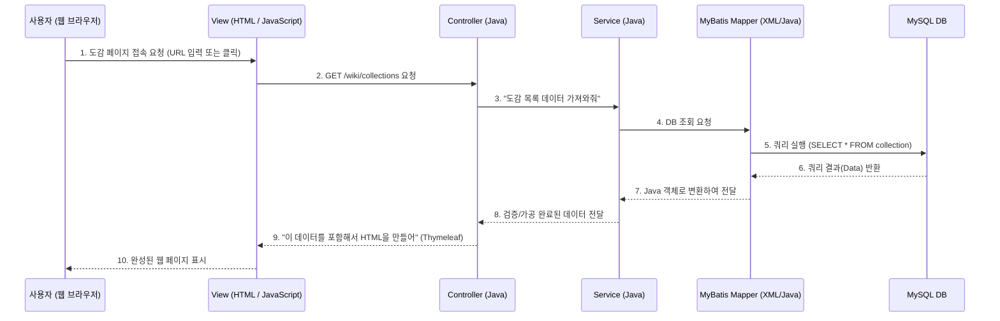

# 🍃 하토피아 위키(Heartopia Wiki) 프로젝트 구조 및 기술 분석서

이 문서는 AI를 통해 생성/개발된 '하토피아 위키' 프로젝트의 전체 구조와 파트별 사용된 기술, 그리고 내부 동작 원리를 쉽게 이해하기 위해 작성되었습니다.

---

## 1. 사용된 기술 스택 (Tech Stack)

프로젝트 빌드 파일(`build.gradle`)과 코드들을 분석한 결과, 전형적인 **Spring Boot 기반의 Server-Side Rendering (SSR) 웹 애플리케이션**입니다.

* **Backend (백엔드)**
  * **언어**: Java 17
  * **프레임워크**: Spring Boot 3.4.2
  * **보안**: Spring Security (비밀번호 암호화 및 관리자 페이지 접근 제어 등에 사용)
* **Frontend (프론트엔드)**
  * **템플릿 엔진**: Thymeleaf (서버에서 생성한 데이터를 HTML에 섞어서 보여주는 역할)
  * **UI / 동작**: HTML5, CSS3, Vanilla JavaScript (기본 자바스크립트)
* **Database (데이터베이스)**
  * **DB 엔진**: MySQL 8.0
  * **ORM/Mapper**: MyBatis 3.0.3 (Java 코드와 SQL을 연결해주는 기술. JPA 대신 직접 SQL 쿼리를 작성하는 방식을 택함)

<br/>

## 2. 전체 폴더 구조 (Directory Structure)

Spring Boot의 표준적인 **MVC(Model-View-Controller) 패턴**을 매우 충실히 따르고 있습니다. 역할을 분담하여 서로 간섭하지 않게 설계되었습니다.

```text
c:\Users\k\Documents\heartopia-wiki-project\
└── heartopia-wiki/
    ├── src/main/java/com/heartopia/wiki/
    │   ├── controller/   👉 프론트엔드(화면)와 백엔드(서버)를 연결해주는 '창구' (HTTP 요청 처리)
    │   ├── service/      👉 비즈니스 로직(핵심 기능)을 처리하는 '공장' (예: 데이터 가공, 검증)
    │   ├── mapper/       👉 DB와 연결을 담당하는 '배달원' (DAO 역할, MyBatis 인터페이스)
    │   ├── model(entity)/👉 DB 테이블과 1:1로 매칭되는 '데이터 껍데기' (객체)
    │   └── exception/    👉 에러/예외 처리를 담당
    │
    └── src/main/resources/
        ├── application.properties 👉 프로젝트 설정 파일 (DB 주소, 비밀번호 등)
        ├── mapper/        👉 직접 작성한 실제 SQL 쿼리문들이 들어있는 XML 파일들
        ├── templates/     👉 사용자에게 보여질 화면(HTML + Thymeleaf)들
        │   ├── wiki/      (도감, 식생 등 위키 관련 HTML)
        │   └── fragments/ (상단바, 하단바 등 공통 UI 조각들)
        └── static/        👉 변하지 않는 파일들 (CSS, JavaScript, 이미지 이미지)
```

<br/>

## 3. 핵심 동작 흐름 (Data Flow)

사용자가 웹 브라우저에서 버튼을 클릭했을 때 어떤 순서로 동작하는지 이해하면 전체 코드를 파악하기 쉽습니다.



<br/>

## 4. 핵심 구성 요소별 분석

### 4.1. `WikiController.java` & `MapController.java` (접수처 역할)
코드를 보면 제일 용량이 큽니다. 사용자가 URL(예: `/wiki`, `/map`)을 입력하고 들어왔을 때, 어떤 화면을 보여줄지 결정하고 화면에 뿌려줄 데이터를 `Service`에 요청합니다.

### 4.2. `MyBatis Mapper (XML)` (쿼리 작성소)
`src/main/resources/mapper` 폴더 안에 있는 `.xml` 파일들입니다. 
AI가 JPA 대신 MyBatis를 선택하여 구조를 짰습니다. 이 방식은 SQL 쿼리를 직접 작성해야 하므로 개발 속도는 조금 더딜 수 있지만, 복잡한 통계 쿼리나 조건 검색(예: 밤에 출현하는 곤충 찾기 등)을 최적화하여 작성하기 좋습니다. 
* `CollectionMapper.xml`: 도감(곤충, 물고기, 작물 등) 데이터를 가져오는 SQL 모음
* `MapPinMapper.xml`: 지도에 찍히는 마커 정보를 관리하는 SQL 모음

### 4.3. `Thymeleaf` 레이아웃 방식 (화면 조각 모음)
`templates/fragments/` 폴더를 보면 `header.html`, `footer.html`이 따로 있습니다.
모든 페이지에 상단바 코드를 복사해서 붙여넣지 않고, 조각(Fragment)으로 만들어두고 템플릿 엔진을 통해 끼워 넣는 형태의 모던한 방식으로 구현되어 있습니다.

---

## 💡 요약 및 조언
AI가 작성했음에도 불구하고 유지보수와 확장이 용이하게 **책임이 잘 분리된 훌륭한 구조**입니다. 만약 새로운 퀘스트 메뉴를 추가하고 싶다면, `QuestController` -> `QuestService` -> `QuestMapper` -> `quest.html` 순서로 하나씩 파일을 늘려가는 패턴을 따라하시면 됩니다!
